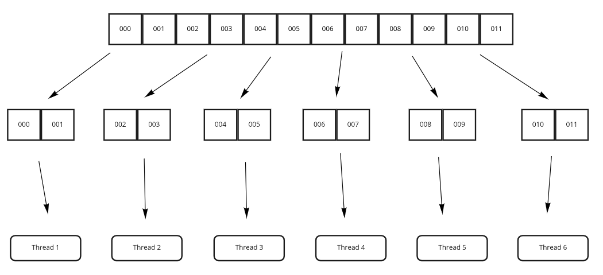
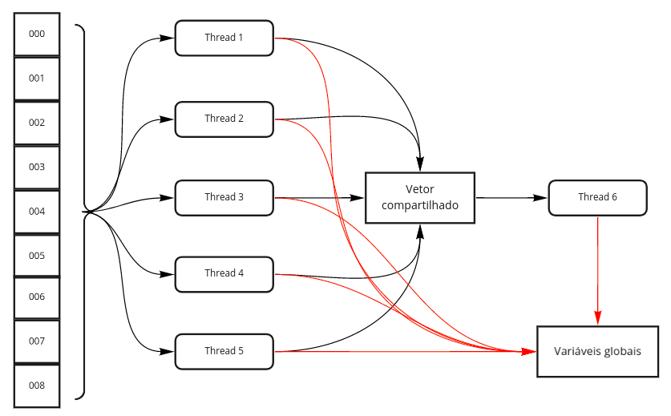
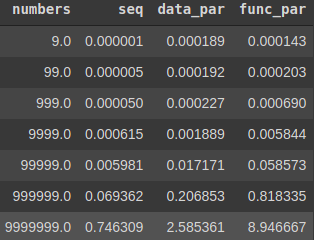
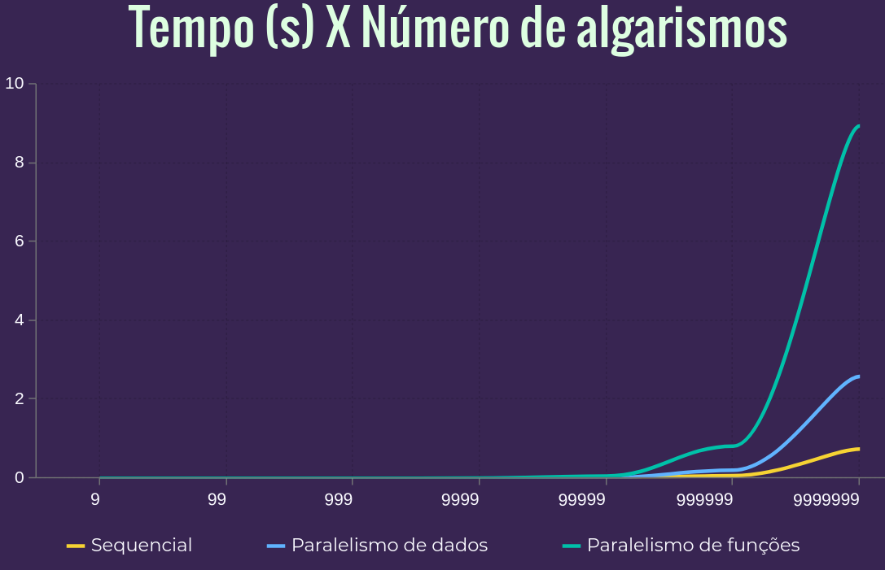

# FSPD - EP 1

## Introdução

Esse exercício de programação teve como objetivo a adaptação de um programa sequencial para versões que usam paralelismo de dados e paralelismo de funções. O programa visa resolver o seguinte problema:

"Uma organização decidiu usar identificadores numéricos para seus membros, mas alguém (um chefe, com certeza) decidiu que certos números não poderiam ser usados. Ele criou algumas regras que determinariam se um número pode ser usado ou não:

- não podem ser palíndromos,
- não podem ser uma sequência menor dobrada (p.ex., 123123),
- não podem ter a soma dos algarismos igual à soma dos algarismos em ordem (p.ex., 012345),
- não podem ter um mesmo algarismo repetido três vezes em sequência,
- nem pode ter um algarismo repetido quatro vezes em qualquer posição do identificador."

A implementação sequencial da solução foi dada pelo professor. A seguir serão discutidas as implementações que utilizam paralelismo, assim como será apresentada a comparação do tempo de execução de todas as versões. 

Foi utilizada a biblioteca `pthread.h` para a implementação das soluções com paralelismo.

## Paralelismo de dados

Para a adaptação da solução de forma que seja usado paralelismo de dados, vê-se necessário o particionamento dos dados de entrada em subconjuntos menores, e cada um desses subconjuntos será processado paralelamente pelas threads.

(A imagem abaixo é meramente ilustrativa, dado que a solução com paralelismo de dados foi implementada com 8 threads).

Essa partição foi feita dividindo o número de elementos na entrada pelo número de threads. Dessa forma, a cada chamada da função `pthread_create` é fornecido como argumento para a thread o index do primeiro e do último elemento do arranjo de dados que aquela thread deverá processar.

O index do primeiro elemento é iniciado em 0 e a cada iteração de criação das threads ele tem seu valor atual acrescido do valor do tamanho de cada intervalo ($\dfrac{n \ elementos}{n \ threads}$) mais 1. Já o valor do último elemento é o valor do primeiro elemento acrescido do tamanho de cada intervalo.

Fora essa alteração, o código da aplicação dos testes de validação dos números para filtrar quais se atém às regras de filtragem estabelecidas permanece praticamente o mesmo. A única alteração feita foi para o tratamento da seção crítica, que consiste basicamente na criação de um mutex que será utilizado pelas threads e, na função `check_num` (responsável pela validação dos números), é ativada a trava do mutex quando uma thread vai atualizar os valores das variáveis globais do sistema. Uma vez que as variáveis são atualizadas, o mutex é liberado.

## Paralelismo de funções

A adaptação da solução para que seja utilizado paralelismo de funções foi um pouco mais desafiadora. Na versão sequencial, são utilizadas 5 funções distintas para verificar cada uma das condições propostas no exercício. Isso implicou na criação de 5 threads distintas na versão com paralelismo de funções, de forma que cada thread irá processar todos os números da entrada sob uma das funções de validação.

Além disso foi criada uma sexta thread, a qual é responsável pelo cálculo do número máximo de condições em um só número, da contagem de números com o máximo de condições, do menor número que tem o máximo de condições e do maior número que tem o máximo de condições.

Dessa forma, as  5 threads que executarão as funções de validação salvam os resultados de cada iteração em um vetor que é compartilhado com a sexta thread, e essa por sua vez executa paralelamente os seus cálculos assim que todas as 5 threads terminam suas respectivas validações para cada um dos dados da entrada.

Vale ressaltar que os resultados individuais de cada uma das 5 threads (os resultados das funções de validação) é atualizado nas respectivas variáveis globais pela própria thread que executa a função. Por exemplo, a thread que verifica se um número é um palíndromo é responsável por atualizar a variável global `palindromes` (contador de quantos palíndromos foram encontrados). Como cada thread é responsável por uma única função, não há concorrência para atualizar o valor dessas variáveis globais.

(Lembrando que cada thread analisa um número da entrada por vez e atualiza o vetor compartilhado, que então é "consumido" pela thread 6. Todas as threads são executadas em paralelo - a thread 6 não é executada apenas após todo o processamento das demais threads).

As implementação da função executada pelas 5 threads é basicamente igual, diferindo apenas na função de validação que será executada. A seção crítica da versão com paralelismo de funções está localizada nessa função, mais especificamente quando uma das 5 threads acaba de realizar a chamada de sua respectiva função de validação e necessita de salvar esse resultado no vetor que é compartilhado entre todas as 6 threads (vetor que é utilizado pela sexta thread para os cálculos listados anteriormente). Para lidar com esse problema de concorrência, similarmente ao que foi feito na versão com paralelismo de dados, foi criado um mutex que é travado toda vez que a escrita nesse vetor compartilhado, e destravado logo depois.

Já a função executada pela sexta thread é razoavelmente mais simples e não tem que lidar com problemas de concorrência. Basicamente itera-se pelo vetor compartilhado e, para cada um dos números, espera-se o processamento de cada uma das outras threads sob ele e assim que este processamento é finalizado, é feito o cálculo dos valores citados anteriormente (chamada da função `update_max`).

## Análise comparativa

Para a realização comparativa dos tempos de execução de cada uma das implementações, foram rodados 100 testes para cada linha da tabela a seguir e retirada a média dos valores obtidos. Além disso, os testes foram com números de um (9) a sete (9999999) algarismos, visto que para quantias maiores que sete seria extremamente demorado testar as implementações com paralelismo.

Os testes foram executados em Dell Inspiron com as seguintes especificações:

- CPU: Intel i7-10510U 4.9GHz
- 16GB memória RAM

A seguinte tabela mostra a relação entre número de algarismos (na coluna "numbers") e o tempo levado para cada implementação ser executada, em segundos. "seq" é a implementação sequencial, "data_par" a com paralelismo de dados e "func_par" a com paralelismo de funções:

Como já pode ser observado na tabela, as implementações com paralelismo demoraram significativamente mais em sua execução do que a implementação sequencial. O gráfico a seguir consegue demonstrar visualmente o aumento dessa discrepância conforme o número de algarismos aumenta:

(Tive pequenas complicações ao plotar o gráfico utilizando Python, peço desculpas por este não estar tão bem detalhado).

Uma possível explicação para o maior tempo de execução das implementações com paralelismo é o fato de, além do overhead para criação e destruição das threads, a presença de partes de seção crítica que necessitaram de tratamento por exclusão mútua com o uso de mutex.

Além disso, a implementação com paralelismo de funções tem seu tempo de execução ainda maior possivelmente pelo fato de que todas as threads que executam uma das funções (5 threads) iteram por todo o vetor de números. Basicamente o vetor de números é percorrido cinco vezes em paralelo, porém devido à seção crítica (e seu respectivo tratamento por exclusão mútua) cada uma das cinco threads que iteram pelo vetor tem interdependências e eventualmente devem aguardar até que a seção crítica seja liberada para continuar sua execução.
